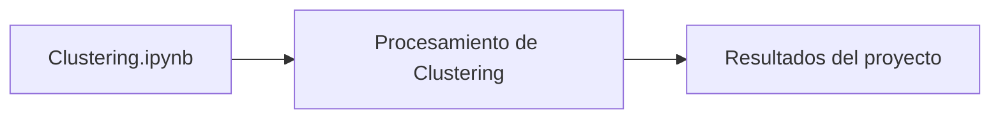

# Clustering — Segmentación de Viviendas en California

## Descripción

Proceso de clusterización sobre datos de viviendas de la ciudad de California, Estados Unidos, a partir de un dataset en formato CSV con variables geográficas (latitud/longitud), estructurales (habitaciones, dormitorios, antigüedad) y socioeconómicas (ingreso medio, valor medio de la vivienda).

## Contenido

- `Clustering.ipynb` — notebook con la carga de datos, exploración visual y proceso de clusterización.

## Diagrama

[Explorar la arquitectura interactiva en GitDiagram](https://gitdiagram.com/HoracioLaphitz/Clustering)



## Tecnologías

Python · Jupyter Notebook · pandas · seaborn

## Cómo ejecutar

```bash
pip install pandas numpy scikit-learn matplotlib seaborn jupyter
jupyter notebook Clustering.ipynb
```

## Autor

Horacio Laphitz — [GitHub](https://github.com/HoracioLaphitz) · [LinkedIn](https://www.linkedin.com/in/horacio-laphitz)
